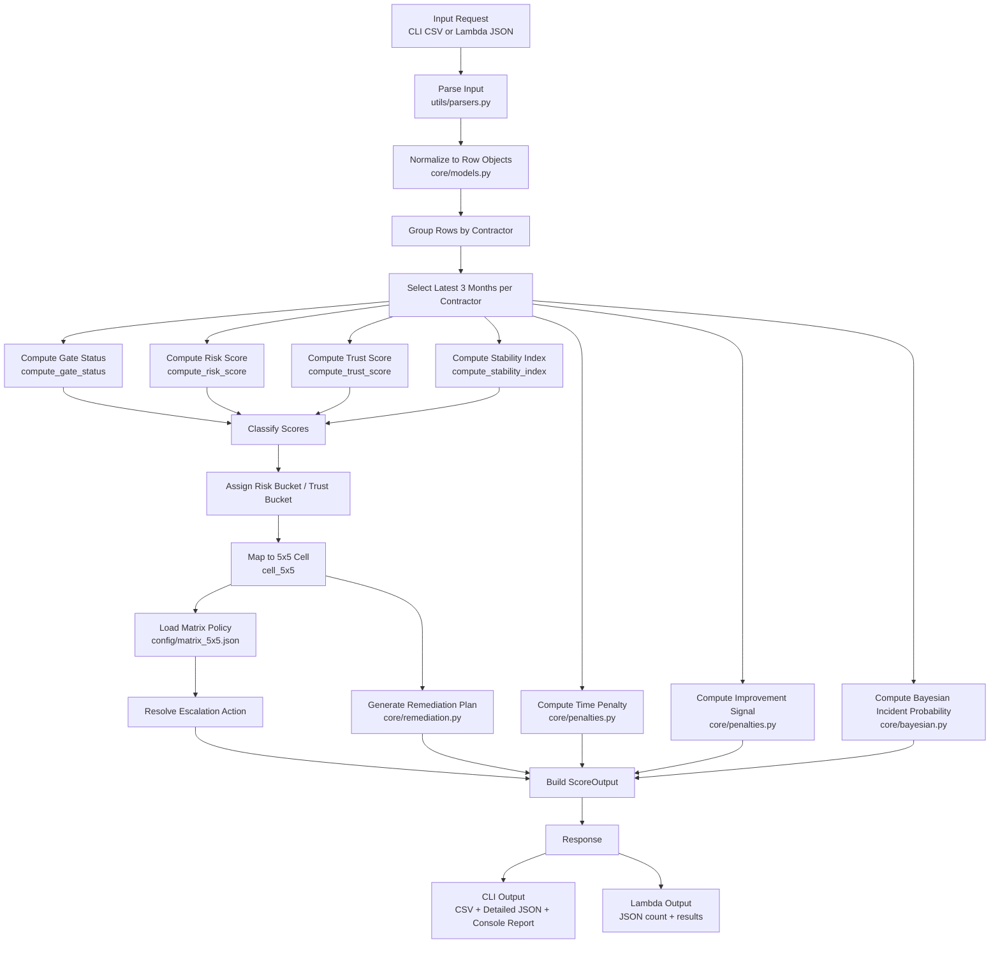

```mermaid
flowchart TD
A[Input Request<br/>CLI CSV or Lambda JSON] --> B[Parse Input<br/>utils/parsers.py]
B --> C[Normalize to Row Objects<br/>core/models.py]
C --> D[Group Rows by Contractor]
D --> E[Select Latest 3 Months per Contractor]

    E --> F[Compute Gate Status<br/>compute_gate_status]
    E --> G[Compute Risk Score<br/>compute_risk_score]
    E --> H[Compute Trust Score<br/>compute_trust_score]
    E --> I[Compute Stability Index<br/>compute_stability_index]

    F --> J[Classify Scores]
    G --> J
    H --> J
    I --> J

    J --> K[Assign Risk Bucket / Trust Bucket]
    K --> L[Map to 5x5 Cell<br/>cell_5x5]

    L --> M[Load Matrix Policy<br/>config/matrix_5x5.json]
    M --> N[Resolve Escalation Action]
    L --> O[Generate Remediation Plan<br/>core/remediation.py]

    E --> P[Compute Time Penalty<br/>core/penalties.py]
    E --> Q[Compute Improvement Signal<br/>core/penalties.py]
    E --> R[Compute Bayesian Incident Probability<br/>core/bayesian.py]

    N --> S[Build ScoreOutput]
    O --> S
    P --> S
    Q --> S
    R --> S

    S --> T[Response]
    T --> U[CLI Output<br/>CSV + Detailed JSON + Console Report]
    T --> V[Lambda Output<br/>JSON count + results]
```
